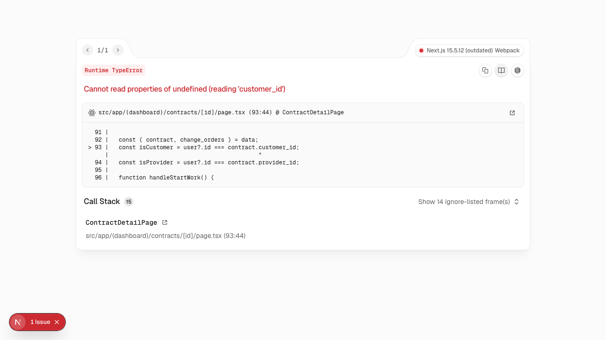
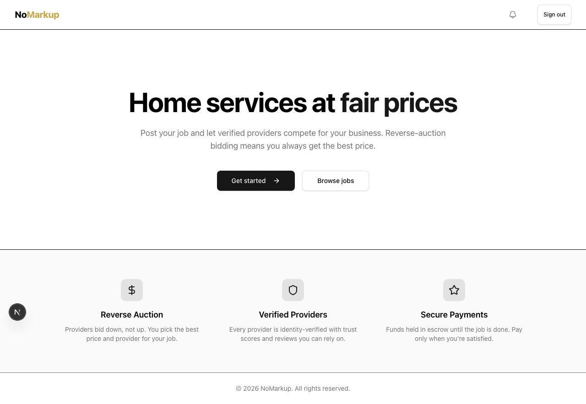
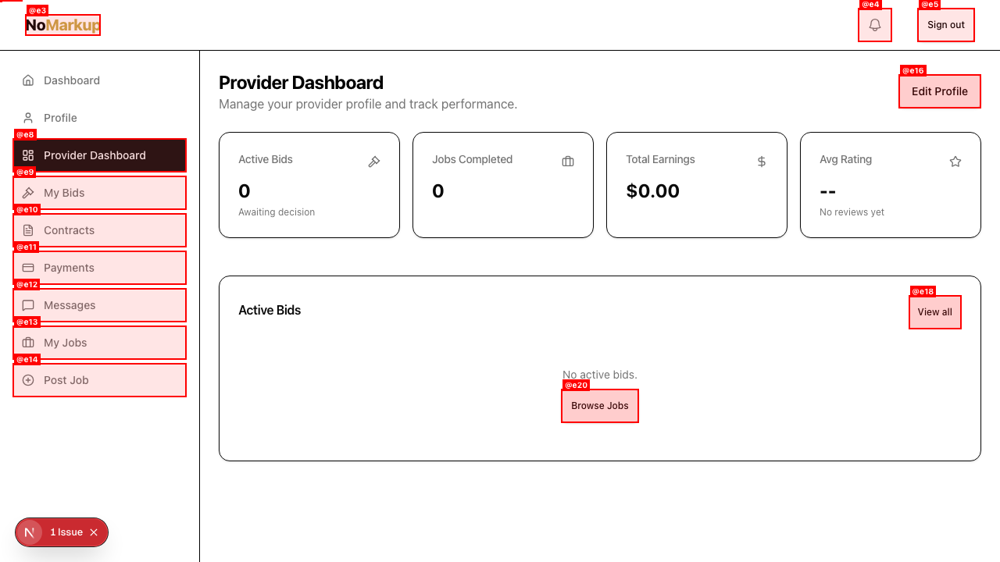
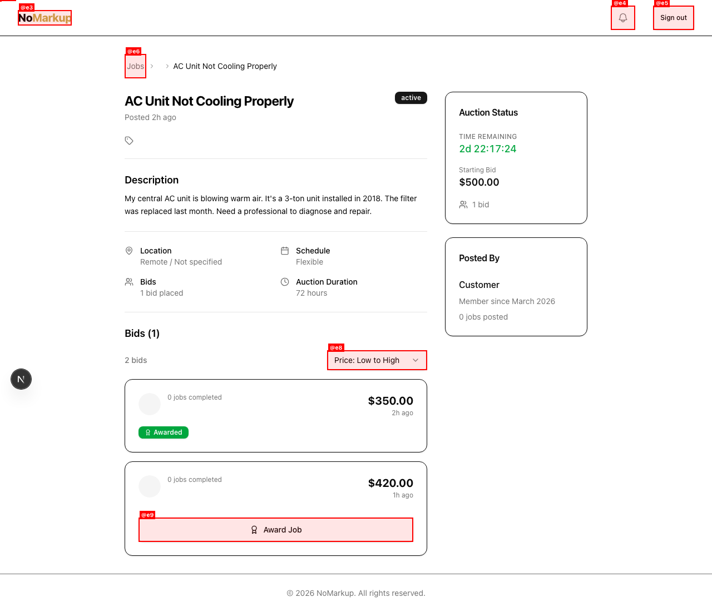
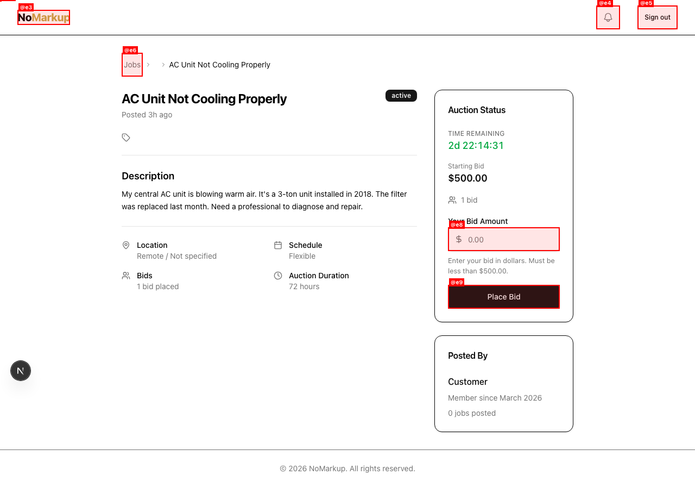
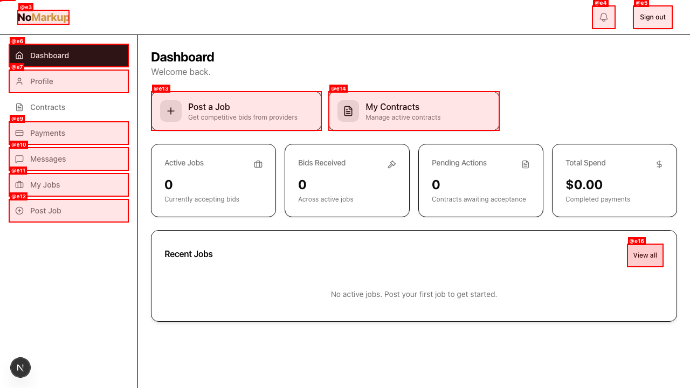
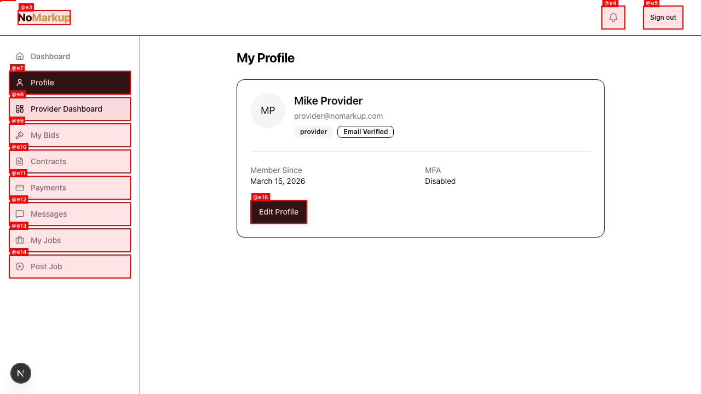
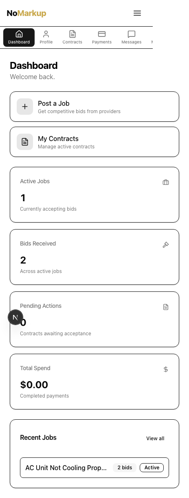

# QA Report: NoMarkup

| Field | Value |
|-------|-------|
| **Date** | 2026-03-15 |
| **URL** | http://localhost:3000 |
| **Scope** | Full app — all user profiles (customer, provider, provider2, admin) |
| **Mode** | full |
| **Duration** | ~15 minutes |
| **Pages visited** | 18 |
| **Screenshots** | 22 |
| **Framework** | Next.js 15.5.12 (App Router) |

## Health Score: 62/100

| Category | Score | Weight |
|----------|-------|--------|
| Console | 40 | 15% |
| Links | 100 | 10% |
| Visual | 85 | 10% |
| Functional | 40 | 20% |
| UX | 70 | 15% |
| Performance | 85 | 10% |
| Content | 77 | 5% |
| Accessibility | 75 | 15% |

## Top 3 Things to Fix

1. **ISSUE-001: Contract detail page crashes with TypeError** — `Cannot read properties of undefined (reading 'customer_id')` at `contracts/[id]/page.tsx:93`. Blocks entire contract workflow.
2. **ISSUE-002: Header shows authenticated UI when logged out** — Notification bell and "Sign out" visible to unauthenticated users. Auth state not clearing correctly.
3. **ISSUE-003: Provider profile API returns 404** — `providerProfile` query fails with 404, causing "Query data cannot be undefined" error on Provider Dashboard.

## Console Health

| Error | Count | First seen |
|-------|-------|------------|
| `Failed to load resource: 500 (Internal Server Error)` | 5 | Homepage (stale server session) |
| `Failed to load resource: 400 (Bad Request)` | 2 | Auth refresh on unauthenticated pages |
| `Failed to load resource: 401 (Unauthorized)` | 1 | Session transition between profiles |
| `Failed to load resource: 404 (Not Found)` | 4 | Provider Dashboard |
| `Query data cannot be undefined [...] "providerProfile"` | 1 | Provider Dashboard |
| `Runtime TypeError: Cannot read properties of undefined (reading 'customer_id')` | 1 | Contract detail page |

## Summary

| Severity | Count |
|----------|-------|
| Critical | 1 |
| High | 3 |
| Medium | 3 |
| Low | 1 |
| **Total** | **8** |

## Issues

### ISSUE-001: Contract detail page crashes with TypeError

| Field | Value |
|-------|-------|
| **Severity** | critical |
| **Category** | functional |
| **URL** | `http://localhost:3000/contracts/[id]` |

**Description:** Clicking any contract card on the Contracts page causes a full-page crash. The `ContractDetailPage` component at `src/app/(dashboard)/contracts/[id]/page.tsx:93` tries to access `contract.customer_id` but `contract` is `undefined`. The API call likely returns data in a different shape than expected, or the contract data isn't loaded before the component renders.

**Repro Steps:**

1. Log in as `customer@nomarkup.com` / `Password123!`
2. Navigate to Contracts page (`/contracts`)
3. Click on contract "NM-2026-00001"
4. **Observe:** Full-page React error overlay:
   `Runtime TypeError: Cannot read properties of undefined (reading 'customer_id')`
   

---

### ISSUE-002: Header shows authenticated UI when logged out

| Field | Value |
|-------|-------|
| **Severity** | high |
| **Category** | functional |
| **URL** | `http://localhost:3000` |

**Description:** After logging out (clearing cookies/localStorage), the homepage header still shows the Notification bell icon and "Sign out" button instead of "Sign in" and "Get started" buttons. The `AuthRestorer` component or Zustand auth store isn't properly resetting state after session invalidation. The `isHydrating` guard in `Header.tsx` may not be re-triggered after cookie expiry.

**Repro Steps:**

1. Log in as any user, then clear cookies/sign out
2. Navigate to homepage
3. **Observe:** Header shows notification bell + "Sign out" instead of "Sign in" + "Get started"
   

---

### ISSUE-003: Provider profile API returns 404, causes console error

| Field | Value |
|-------|-------|
| **Severity** | high |
| **Category** | functional |
| **URL** | `http://localhost:3000/provider-dashboard` |

**Description:** When logged in as a provider, the Provider Dashboard makes API calls that return 404 Not Found. The TanStack Query for `providerProfile` receives `undefined` data, triggering: `"Query data cannot be undefined. Please make sure to return a value other than undefined from your query function."` The "1 Issue" badge appears in the bottom-left corner. The Provider Dashboard shows 0 jobs completed despite the provider having active contracts in the seed data.

**Repro Steps:**

1. Log in as `provider@nomarkup.com` / `Password123!`
2. Navigate to Provider Dashboard
3. **Observe:** Console shows 404 errors and "Query data cannot be undefined" for `providerProfile`
   

---

### ISSUE-004: Bid count inconsistency on job detail page

| Field | Value |
|-------|-------|
| **Severity** | medium |
| **Category** | content |
| **URL** | `http://localhost:3000/jobs/[id]` |

**Description:** The job detail page for "AC Unit Not Cooling Properly" shows conflicting bid counts:
- Section heading says "Bids (1)"
- Below heading says "2 bids"
- Auction Status sidebar says "1 bid"
- Two bid cards are actually rendered

The heading and sidebar appear to use a different data source than the bid list.

**Repro Steps:**

1. Log in as customer, navigate to job detail for "AC Unit Not Cooling Properly"
2. **Observe:** "Bids (1)" heading but "2 bids" count and 2 bid cards shown
   

---

### ISSUE-005: "Posted By" shows "0 jobs posted" for customer with 3 jobs

| Field | Value |
|-------|-------|
| **Severity** | medium |
| **Category** | content |
| **URL** | `http://localhost:3000/jobs/[id]` |

**Description:** The "Posted By" sidebar on job detail pages shows "0 jobs posted" for the customer who has 3 active jobs (confirmed on the My Jobs page). The job count likely isn't being fetched or calculated correctly from the user profile.

**Repro Steps:**

1. View any job detail page
2. **Observe:** "Posted By" section shows "0 jobs posted"
   

---

### ISSUE-006: Admin has no admin-specific interface

| Field | Value |
|-------|-------|
| **Severity** | high |
| **Category** | functional |
| **URL** | `http://localhost:3000/dashboard` (logged in as admin) |

**Description:** The admin user (`admin@nomarkup.com`) sees the exact same dashboard as a regular customer — no admin panel, no user management, no dispute resolution, no platform settings. The sidebar navigation is identical to the customer role. The profile page also shows a "Become a Provider" button, which is inappropriate for an admin.

**Repro Steps:**

1. Log in as `admin@nomarkup.com` / `Password123!`
2. Navigate to Dashboard
3. **Observe:** Standard customer dashboard with no admin functionality
   

---

### ISSUE-007: Provider profile page missing business information

| Field | Value |
|-------|-------|
| **Severity** | medium |
| **Category** | ux |
| **URL** | `http://localhost:3000/profile` (logged in as provider) |

**Description:** The provider's profile page (`/profile`) only shows basic user info (name, email, role badge, member since, MFA status). It's missing all provider-specific information that exists in the seed data: business name, service categories, service area/radius, Stripe connection status, jobs completed, on-time rate, trust score, and ratings. A provider has no way to view or manage their business profile from this page.

**Repro Steps:**

1. Log in as `provider@nomarkup.com`
2. Navigate to Profile
3. **Observe:** Only basic user info shown, no business details
   

---

### ISSUE-008: Mobile floating "N" button overlaps content

| Field | Value |
|-------|-------|
| **Severity** | low |
| **Category** | visual |
| **URL** | `http://localhost:3000/dashboard` (mobile viewport) |

**Description:** On mobile viewport (375x812), the circular "N" floating action button in the bottom-left corner overlaps with the "Pending Actions" stat card content. The number "0" is partially obscured by the button.

**Repro Steps:**

1. Log in as customer, resize to mobile viewport (375px wide)
2. Scroll to view dashboard stats
3. **Observe:** "N" button overlaps the Pending Actions count
   

---

## Pages Tested

| Page | Customer | Provider | Provider2 | Admin | Status |
|------|----------|----------|-----------|-------|--------|
| Homepage (public) | - | - | - | - | OK (header auth bug) |
| Login | OK | OK | OK | OK | OK |
| Register | - | - | - | - | OK (validation works) |
| Forgot Password | - | - | - | - | OK |
| Dashboard | OK | OK | OK | Missing admin UI | Partial |
| Profile | OK | Missing biz info | - | Has "Become Provider" | Partial |
| Edit Profile | OK | - | - | - | OK |
| My Jobs | OK | - | - | - | OK |
| Job Detail | Bid count bug | Bid form OK | - | - | Partial |
| Browse Jobs | - | OK (filters work) | - | - | OK |
| My Bids | - | OK | OK | - | OK |
| Provider Dashboard | - | 404 errors | - | - | Broken |
| Contracts (list) | OK | - | - | - | OK |
| Contract Detail | Crashes | - | - | - | Broken |
| Payments | OK (empty state) | - | - | - | OK |
| Messages | OK (empty state) | - | - | - | OK |
| Post Job wizard | OK (step 1) | - | - | - | OK |
| Notifications | OK (dropdown) | - | - | - | OK |

## What Works Well

- **Login flow**: Fast, clean, works for all 4 user profiles with correct redirects
- **Form validation**: Registration form shows clear inline error messages
- **Mobile layout**: Responsive bottom nav, stacked cards, hamburger menu
- **My Jobs page**: Clean grid layout with tab filtering and job cards
- **My Bids page**: Shows bid history with won/lost status and price comparison
- **Browse Jobs**: Full filter panel (search, category, schedule, price, location, radius)
- **Post Job wizard**: 6-step multi-page form with 16 service categories
- **Empty states**: Payments and Messages show proper empty state messaging
- **Notification dropdown**: Clean dropdown with bell icon and "View all" link
- **Accessibility**: Skip links present, proper heading hierarchy, ARIA attributes on nav
